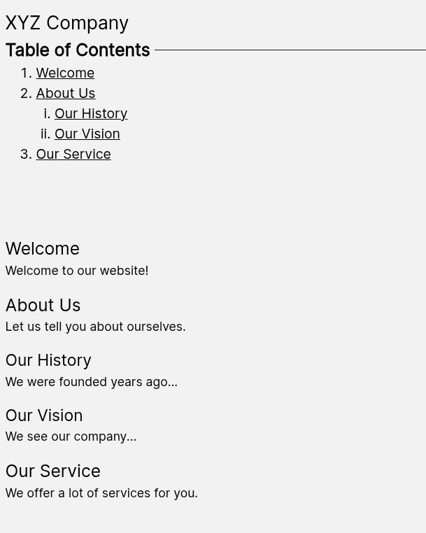

# use-page-headings-tree

A React hook to automatically generate a navigation tree from a list of heading nodes. It generates a nested JSON object containing the headings, their `id` values, child nodes, and level.  That JSON can be fed into another component to render a table of contents for your page.

This project was adapted from [kbrock84's use-page-headings-tree](https://github.com/kbrock84/use-page-headings-tree).  The reason for the fork was that I needed a Typescript implementation of it in addition to updating the dependencies to support React 19 as the original project was made for React 16 in JS.

I also wanted a simpler, slimmer output format that I could feed right into a table of contents component.

This hook will parse the DOM for heading elements, find the ones that have `id` attributes, and generate a nested JSON object in the following shape:

```typescript
interface NodeTree {
    id: string                  // ID of the heading
    title: string               // The heading text value
    children: NodeTree[]        // Nested nodes
    level: number               // Heading level
}
```
Once the headings are processed into that, just render them recursively.  There is an example of that further down in the README.

## Install
I'm not currently packaging this up as an NPM module, though I may do that in the future if there's demand.  

To install, just add the file `use-page-headings-tree.ts` from the repo into your project, import the `NodeTree` type def if you need it, and the `usePageHeadingsTree` hook function.

## Usage
> **Note**: This works by querying the DOM for `HTMLHeadingElement` elements after the page hydrates, so it must be called from a client component if you are using a server-side rendering framework such as Next.js.  

In your component, you'll need to create two state variables: one to hold the list of heading nodes and the other to hold the node tree it generates.

```typescript
// Holds the heading nodes that it will query from the DOM
const [headingNodes, setHeadingNodes] = useState<NodeListOf<HTMLHeadingElement>| HTMLHeadingElement[]>([])

// Holds the generated heading tree
const [headingTree, setHeadingTree] = useState<NodeTree[]|null>(null)
```

> **Note**:  The actual type of the `headingNodes` variable is `NodeListOf<HTMLHeadingElement>` but in order to appease the Typescript gods as I converted this from the original JS version, I had to make it optionally accept an `<HTMLHeadingElement>[]` array.
>
> Reason being, there needs to be a defined initial value of an empty array of the correct type , and there is no way I'm aware of to create an empty `NodeListOf`.  The initial value is used as a dependency for `useEffect` in the hook, and I had problems trying to use an undefined initial state.  Thus, this Typescript hack.

Once you've got the state variables in place, add an effect that runs a `querySelectorAll` against the element that contains your content.

Only headings H2->H6 are queried or handled by the hook.  The reason is that this is for a table of contents, and H1 elements are generally used for the page title, and generally only one H1 element should be present on a page for proper structuring and accessibility considerations.


```typescript
useEffect(() => {
    const nodes = document.getElementById('main')?.querySelectorAll<HTMLHeadingElement>("h2,h3,h4,h5,h6") ?? []
    setHeadingNodes(nodes)
},[])
```
Here, I'm using a static reference to a div with the id `main` to query against.  That works for my project, but may not for yours.  You can also use a React `ref` with `useRef()` and query that.  

Finally, call the hook function.  The first parameter is the state variable with the list of heading nodes, and the second is the setter function for the heading tree it will generate.  When the hook is called, it will populate the `headingTree` state variable which you can then render.

```typescript
usePageHeadingsTree(headingNodes, setHeadingTree)
```

### Putting it All Together
Below is a simple example table of contents that is generated automatically.  Each links to the `#id` of the heading and does a smooth scroll into view.  

#### `table-of-contents.tsx`
```typescript
'use client'
import { NodeTree, usePageHeadingsTree } from "@/lib/use-page-headings-tree"
import { RefObject, useEffect, useState } from "react"

interface TableOfContentsProps {
    // Pass an ID if you are calling from a SSR'd component/page
    id?: string
    
    // Pass a RefObject if the parent component is client-side rendered.
    // Adjust type if you need a different container element
    container?: RefObject<HTMLDivElement|null>    
}

export default function TableOfContents(props: TableOfContentsProps) {
    
    const [headingNodes, setHeadingNodes] = useState<NodeListOf<HTMLHeadingElement>| HTMLHeadingElement[]>([])
    
    const [headingTree, setHeadingTree] = useState<NodeTree[]|null>(null)
    
    useEffect(() => {
        // Get a reference to the container to query for the headings
        const container = props.container?.current 
            ? props.container.current
            : props.id
                ? document.getElementById(props.id)
                : undefined
        
        // Query the container for heading nodes
        const nodes = container?.querySelectorAll<HTMLHeadingElement>("h2,h3,h4,h5,h6") ?? []

        // Save the discovered heading elements to the state variable
        setHeadingNodes(nodes)
    },[props.container])
    
    usePageHeadingsTree(headingNodes, setHeadingTree)
    
    return (
        <div role="navigation" className="flex flex-col w-full gap-4 mb-2 w-full">
            <h2 id="TableOfContents">Table of Contents</h2>
            <ol className="list-decimal ml-6 font-medium">
                {headingTree?.map((i:NodeTree) => 
                    <TableOfContentsItem {...i} key={i.id}/>  
                )}
            </ol>
            
        </div>
    )
}

function TableOfContentsItem(props:NodeTree) {
    return (
        <li>
            <a className="underline cursor-pointer" href={`#${props.id}`} title={props.title}
                onClick={(e) => {
                    e.preventDefault()
                    document.getElementById(props.id)?.scrollIntoView({block: 'start', behavior: 'smooth'})
                }}
            >
                {props.title}
            </a>
            {props.children && (
                <ol className="list-[lower-roman] ml-6">
                    {props.children?.map((i:NodeTree) => <TableOfContentsItem {...i} key={i.id} />)}
                </ol>
            )}
        </li>
    )
}
```

#### `page.tsx` (Client-side render)
This example uses client-side rendering and passes a reference to the container element.  Since `useRef` requires the component to be rendered on the client, the page itself is client-side rendered as well as the ToC.

```typescript
'use client'
import TableOfContents from '@/components/table-of-contents'
import { useRef } from "react"

export default function Page() {
    const content = useRef<HTMLDivElement>(null)
    return (
        <div>
            <h1>XYZ Company</h1>

            <TableOfContents container={content} />

            <section ref={content}>
                <h2 id="welcome">Welcome</h2>
                <p>Welcome to our website!</p>

                <h2 id="about-us">About Us</h2>
                <p>Let us tell you about ourselves.</p>

                <h3 id="history">Our History</h3>
                <p>We were founded years ago...</p>

                <h3 id="vision">Our Vision</h3>
                <p>We see our company...</p>

                <h2 id="services">Our Service</h2>
                <p>We offer a lot of services for you.</p>
            </section>
        </div>
    )
}
```

#### `page.tsx` (Server-side render)
Here, we're giving the container element an id and passing that string to the `TableOfContents` component.  This allows the page to be rendered server-side with only the `TableOfContents` component rendering client-side.

```typescript
import TableOfContents from '@/components/table-of-contents'

export default function Page() {
    const content=useRef<HTMLDivElement>(null)
    return (
        <div>
            <h1>XYZ Company</h1>

            <TableOfContents id="content" />

            <section id="content">
                <h2 id="welcome">Welcome</h2>
                <p>Welcome to our website!</p>

                <h2 id="about-us">About Us</h2>
                <p>Let us tell you about ourselves.</p>

                <h3 id="history">Our History</h3>
                <p>We were founded years ago...</p>

                <h3 id="vision">Our Vision</h3>
                <p>We see our company...</p>

                <h2 id="services">Our Service</h2>
                <p>We offer a lot of services for you.</p>
            </section>
        </div>
    )
}
```
#### Output



## Notes

### Only heading elements with an id value are processed
Since this is to generate a table of contents, it requires there to be an `id` attribute on each discovered heading in order to create the link.  Any headings that are found that lack an `id` attribute are not added to the `NodeTree`.

This also includes lower level headings, even if they have `id` values, if the parent does not have an `id`.

The tree will still generate, but whatever level lacks an `id` will not be included, including its children.

### Skipping a heading level will throw an error
The original project does handle this as a deliberate error, and I could have patched it to proceed anyway, but chose not to.  Consider this an accessibility checker and warning system.

If you skip a heading level, such as going from `<h2>` to `<h4>` with no `<h3>` in between, it will throw an error.  If this happens, check to make sure your headings are all in order.

### H1 elements are ignored
Correct semantics state that there should only be one `<h1>` tag on the page as it is intended to define the most importing heading.  That is typically used for the page title.

Typically the title isn't part of the table of contents, so there's really no use accounting for it.

The original project doesn't handle `<h1>`'s when building the tree, and I opted not to change that.

Learn more [here](https://www.boia.org/blog/multiple-h1-tags-are-bad-for-accessibility-and-seo).